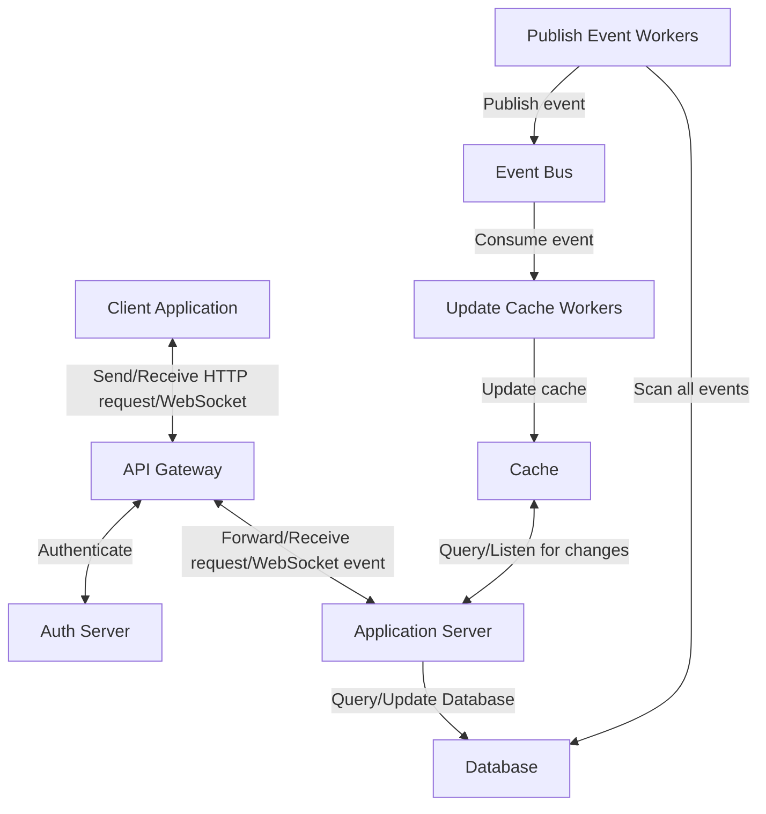
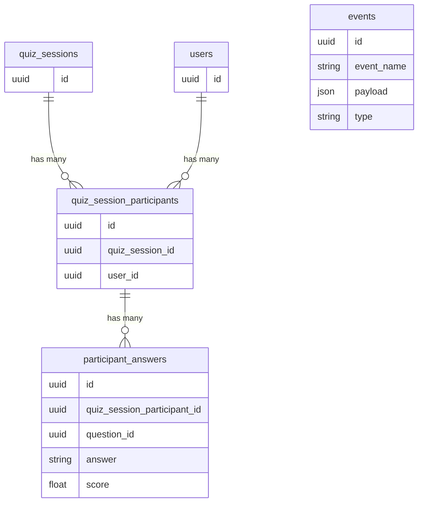
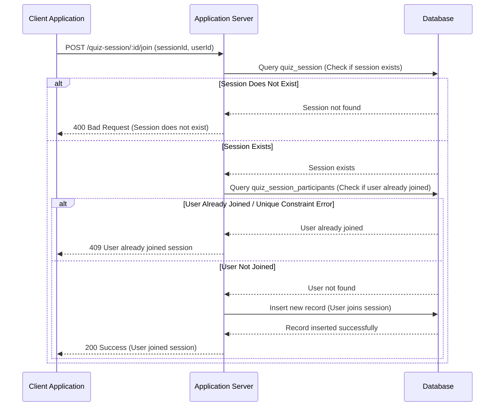
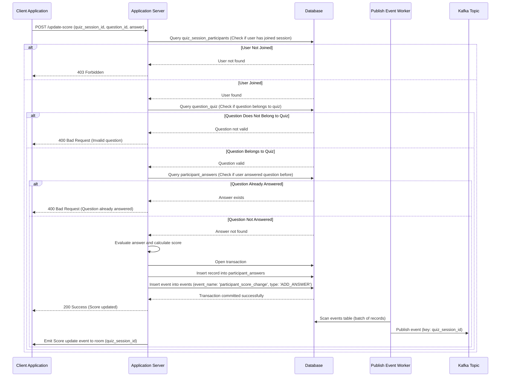
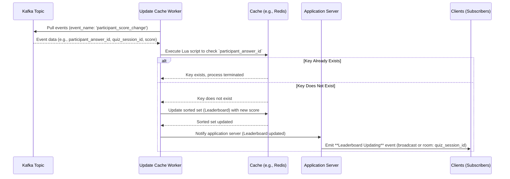

## Architecture Diagram


## Database Diagram


**Notes:** 
 - `UNIQUE(quiz_session_id, user_id) in quiz_session_participants`
 - `UNIQUE(quiz_session_participant_id, question_id) in participant_answers`

## Technologies
### 1. **Application Server, Worker Services: Node.js**
    Chosen for its high IO handling capabilities, event-driven architecture, and non-blocking asynchronous processing, which makes it ideal for real-time applications and services.

### 2. **API Gateway: Kong**
    An open-source, extensible, and high-performance API gateway that simplifies managing, monitoring, and securing APIs with features like rate-limiting, authentication, and load balancing.

### 3. **Database: Postgres**
    A powerful, open-source relational database with advanced features and strong ACID compliance, ensuring data integrity and scalability.

### 4. **Cache: Redis**
    In-memory data structure store offering ultra-fast read/write operations, perfect for caching frequently accessed data and reducing database load.

### 5. **WebSocket Adapter: Redis Stream**
    Provides a reliable, distributed messaging system with low-latency capabilities, making it suitable for real-time data streaming and WebSocket-based communication.

### 6. **Event Bus: Kafka**
    A distributed event streaming platform designed for high throughput, fault tolerance, and real-time processing of large-scale event data. Supports strict ordering of events within topics and partitions.


## Technical Approach
- **Dual Write Handling:** Use the outbox pattern for greater flexibility to implement business rules and decouple from the underlying database technology.


## Flows

### Authentication
- The client sends the request to the API Gateway, which authenticates/authorizes the request.  
- If the request is invalid, the gateway responds with a `401/403` error to the client. Otherwise, it forwards the request to the application server.

---

### User Joining a Quiz Session
1. The client sends an HTTP request to the server with the quiz session ID.  
2. The application server queries the `quiz_session_participants` table to check if the user has already joined the session:  
   - If the session not found or missing in the request, return 400
   - If the user is already joined or if a unique constraint error occurs, return a `409 User already joined session` error.  
   - Otherwise, insert a record into the database.  

**Sequence Diagram:**


---

### Updating Scores
1. The client sends an HTTP request to the server with `quiz_session_id`, `question_id`, and `answer`.  
2. The application server:
   - Queries the `quiz_session_participants` table to check if the user has joined the session. If not, it responds with a `403 Forbidden`.  
   - Queries the `question_quiz` table to ensure the question belongs to the quiz. If not, it responds with a `400 Bad Request`.  
   - Queries the `participant_answers` table to check if the user has already answered the question. If yes, it returns a `400 Bad Request`.  
3. Evaluates the answer, calculates the score, and inserts a record into `participant_answers` and `events` (with `event_name: 'participant_score_change', type: 'ADD_ANSWER'`).  
4. A publish event worker scans a batch of records in the `events` table and publishes them to a Kafka topic.  
   - **Key:** `quiz_session_id` to ensure all events for a quiz session go to the same partition.  
   - **Optimization:** Use Optimistic Locking to prevent duplication and enhance performance.
5. The application server emits a **Score update** room(`quiz_session_id`) event with 

**Sequence Diagram:**

---

### Getting the Current Leaderboard
- The client application establishes a WebSocket connection with the application server.  
- When the user accesses the leaderboard page, the client sends a request to the application server to retrieve the current leaderboard.  
- The application server queries Redis (using the Sorted Sets data type) to get the current leaderboard.

---

### Real-Time Leaderboard Updates
- Update Cache Workers pull events from Kafka (`participant_score_change`) and update the cache.
- Handle duplication messages cause of `At least once semantics`
    - To update the cache, write a lua script to check if the key `participant_answer_id` is already added or not, if no, update the sorted sets (Leaderboard), otherwise, end the process
- The application server emits a **Leaderboard Updating** event (via broadcast or room event).  

**Sequence Diagram:**

---
## How to Run
1. Create .env file from .env.example
2. Start the services using Docker Compose:
   ```bash
   docker-compose up
   ```

3. Run database migrations:
   ```bash
   npm run migration:up
   ```

4. Seed the database with initial data:
   ```bash
   npm run seed:up
   ```

---